# Inventario Inteligente — Fase 1

## Decisión de arquitectura

Park Plaza continúa como monolito modular. El ERP, la experiencia del cliente, Express, Socket.IO y Docker conservan sus contratos actuales. El inventario relacional se incorpora mediante migración gradual:

1. `app_state` se conserva temporalmente para los endpoints heredados.
2. Las tablas relacionales se crean con una migración versionada y reversible.
3. Los datos existentes se importan mediante claves `legacy_id` e idempotencia.
4. Toda mutación de inventario heredada publica su variación en el ledger relacional dentro de la misma transacción PostgreSQL.
5. Si falla el ledger, también se revierte la modificación de `app_state`.
6. Los módulos futuros podrán cambiar su lectura al modelo relacional sin reemplazar el resto del sistema.

## Modelo

```mermaid
erDiagram
  INVENTORY_CATEGORIES ||--o{ INVENTORY_PRODUCTS : clasifica
  INVENTORY_UNITS ||--o{ INVENTORY_PRODUCTS : unidad_base
  INVENTORY_PRODUCTS ||--o{ INVENTORY_PRESENTATIONS : presenta
  INVENTORY_PRODUCTS ||--o{ INVENTORY_PRODUCT_CONVERSIONS : convierte
  INVENTORY_PRODUCTS ||--o{ INVENTORY_LOTS : lotes
  INVENTORY_WAREHOUSES ||--o{ INVENTORY_STOCK_BALANCES : almacena
  INVENTORY_PRODUCTS ||--o{ INVENTORY_STOCK_BALANCES : saldo
  INVENTORY_PRODUCTS ||--o{ INVENTORY_MOVEMENTS : registra
  INVENTORY_SUPPLIERS ||--o{ INVENTORY_PURCHASE_ORDERS : suministra
  INVENTORY_PURCHASE_ORDERS ||--o{ INVENTORY_PURCHASE_ORDER_LINES : contiene
  INVENTORY_PURCHASE_ORDERS ||--o{ INVENTORY_GOODS_RECEIPTS : recibe
  INVENTORY_TRANSFERS ||--o{ INVENTORY_TRANSFER_LINES : contiene
  INVENTORY_RECIPES ||--o{ INVENTORY_RECIPE_VERSIONS : versiona
  INVENTORY_RECIPE_VERSIONS ||--o{ INVENTORY_RECIPE_INGREDIENTS : consume
  INVENTORY_PRODUCTION_BATCHES ||--o{ INVENTORY_PRODUCTION_INPUTS : entradas
  INVENTORY_PRODUCTION_BATCHES ||--o{ INVENTORY_PRODUCTION_OUTPUTS : salidas
  INVENTORY_SHIFT_SESSIONS ||--o{ INVENTORY_PHYSICAL_COUNTS : cuenta
  INVENTORY_PHYSICAL_COUNTS ||--o{ INVENTORY_PHYSICAL_COUNT_LINES : detalla
  INVENTORY_SHIFT_SESSIONS ||--o{ INVENTORY_CLOSINGS : cierra
```



### Cantidades y costos

- Cantidades: `NUMERIC(18,6)`.
- Factores de conversión: `NUMERIC(18,9)`.
- Costos unitarios: `NUMERIC(18,6)`.
- Totales comerciales: `NUMERIC(18,2)`.
- Cada producto referencia obligatoriamente una unidad base.
- Cada presentación tiene un factor positivo hacia la unidad base.
- Una conversión genérica solo puede relacionar unidades de la misma dimensión.
- Masa-volumen exige `product_id`, por tratarse de una conversión específica.

## Integridad

- Claves foráneas en todas las relaciones operativas.
- `legacy_id` único para impedir dobles migraciones.
- `idempotency_key` única para impedir publicar dos veces un movimiento.
- Saldo único por producto, almacén y lote, incluyendo el caso sin lote.
- Bloqueo de fila al publicar movimientos concurrentes.
- Bloqueo asesor por idempotencia.
- Stock negativo rechazado por defecto.
- La excepción requiere usuario, motivo y `negative_authorized=true` en metadata.
- Los movimientos no admiten `UPDATE` ni `DELETE`.
- Una corrección se representa mediante otro movimiento con `reversal_of_id`.

## Almacenes iniciales

- `GENERAL`: almacén general.
- `RESTAURANTE`: almacén operativo de cocina.
- `BARTENDER`: almacén operativo de bar.

Los productos heredados se ubican inicialmente en el almacén de su área para conservar exactamente los saldos actuales. Una fase posterior habilitará transferencias operativas desde `GENERAL`.

## Migración segura

La migración `001_inventory_intelligent`:

- Crea el modelo relacional completo de la primera fase.
- No elimina ni modifica `app_state`.
- Migra productos, saldos, recetas, proveedores, compras, producción, mermas, movimientos y cierres disponibles.
- Usa un saldo de apertura en el punto de corte.
- Conserva movimientos anteriores como referencias históricas sin volver a afectar el saldo.
- Registra checksum y resultado en `inventory_migration_runs`.
- Puede ejecutarse varias veces sin duplicar datos.

## Comandos

Desde la raíz del proyecto:

```powershell
npm run db:migrate
npm run test:inventory-phase1
docker compose up -d --build
```

Estado relacional, después de iniciar sesión como empleado:

```text
GET /api/inventory/relational/status
```

Rollback del modelo relacional:

```powershell
npm run db:rollback
```

El rollback elimina solamente las tablas de esta fase. `app_state` permanece intacto. En producción debe ejecutarse únicamente con respaldo y durante una ventana controlada, porque los movimientos creados después del corte todavía no se reconstruyen automáticamente en sentido inverso hacia el JSON.

## Prueba manual

1. Abrir `http://localhost:5173/login`.
2. Ingresar como administrador, restaurante y bartender.
3. Verificar inventario y pedidos existentes.
4. Registrar una entrada pequeña con referencia identificable.
5. Registrar una salida compensatoria por la misma cantidad.
6. Confirmar que el stock final coincide con el inicial.
7. Consultar el estado relacional y verificar que aumentó el número de movimientos.
8. Reiniciar PostgreSQL y backend.
9. Volver a verificar stock, recetas y pedidos.

## Alcance pendiente

Esta fase prepara todas las entidades, restricciones y trazabilidad, pero mantiene las pantallas y endpoints heredados. Las siguientes fases deben trasladar de manera gradual compras, recepciones, transferencias, producción y cierres para que lean directamente del modelo relacional y apliquen autorización granular por rol y área.
